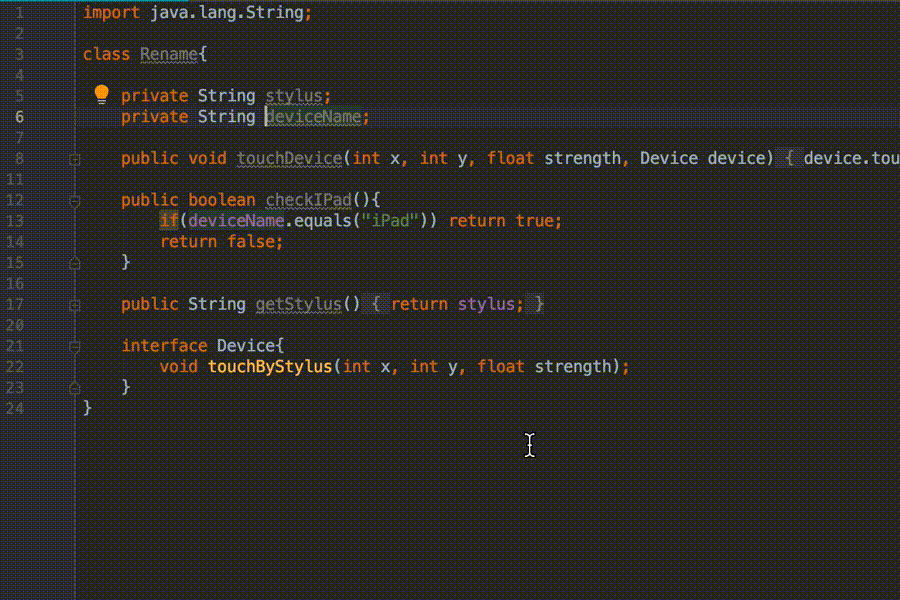

`현재 시장에는 개발자를 위한 많은 통합개발환경(이하 IDE)가 있다.`  
`본 글에서는 주류로 많이 사용중인 Eclipse, VS Code, IntelliJ 를 비교분석 해보도록 한다.`

# 1. Eclipse

[https://www.eclipse.org/](https://www.eclipse.org/)

역사가 오래된 IDE로 많은 개발자 커뮤니티, 잘 작성된 문서, 수 많은 플러그인들이 존재한다.

웹, 모바일, 데스크탑, 엔터프라이즈, 엠베디드 시스템 어플리케이션 개발에 사용되며  
Eclipse 는 자바(JAVA)로 개발되어 있어 윈도우즈, 리눅스, 맥OS 등 대부분의 OS를 지원한다.

자바를 위해 개발되었지만 C/C++, PHP, Rust, Groovy, Scala, Python 등의 언어도 지원한다.

* 장점> 라이센스가 Eclipse Public License 로 배포되어 무료로 자유롭게 사용할 수 있다.
* 단점> 자바로 만들어져서 자바가상머신(JVM) 위에서 실행되므로 다른 IDE에 비교해서 속도가 느리다.

***

# 2. VS Code

[https://code.visualstudio.com/](https://code.visualstudio.com/)

마이크로소프트에서 개발한 IDE로 기본기능은 코드편집기 수준이지만, 추가적인 플러그인을 설치하면 타 IDE 못지않는 역활을 수행한다.  
VS Code 는 엘렉트론 프레임워크로 개발 되어있고 윈도우즈, 리눅스, 맥OS를 지원하며 속도도 상당히 빠르다.  
많은 플러그인들의 지원으로 .NET, Java, JavaScript, Python 등 현존하는 대부분의 백엔드, 프론트엔드 개발을 거의 다 지원한다.  
게임개발툴로 유명한 유니티의 IDE도 VS Code를 사용한다.

- 장점> 네이티브 코드로 작성되어 속도가 가장 빠르다.
- 단점> 적정한 확장프로그램(플러그인)을 찾아 설치해야 쓸만한 환경을 구축할 수 있다.

***

# 3. IntelliJ

[https://www.jetbrains.com/idea/](https://www.jetbrains.com/idea/)

JetBrain사에서 만든 IDE이다.  
자바 어플리케이션을 만드는데 특화 되어 있으나, 자바외에 Kotlin, Scala, Android, Mercurial, Groovy 등의 언어도 지원한다.

주목할만점으로는 다양한 벡엔드&프론트엔드 프로젝트 생성, 자동완성(auto completion), 소스코드분석, 지능형리펙토링, 디버거, 테스트러너 기능이 비교된 IDE 중에서 가장 우수하다.  
이러한 기능들 덕분에 개발자의 생산성이 대폭 향상 된다.

Eclipse 로 생성된 프로젝트를 IntelliJ 프로젝트로 가져오거나(Import),  
IntelliJ 로 생성된 프로젝트를 Eclipse 프로젝트로 내보내는(Export) 기능도 충실해서 Eclipse 사용자와 협업도 문제가 없다.

안드로이드 IDE인 안드로이드 스튜디오도 IntelliJ에 근간을 두고 있다.

유로 버젼인 Ultimate 버젼과, 무료 버젼인 Community 버젼으로 나뉘어 있다.

+ 장점> 우수한 스마트 코드 작성 기능들 덕분에 개발자의 생산성을 대폭 높여준다.
+ 단점> 모든 기능을 사용할 수 있는 Ultimate 버젼은 유료 라이센스이다.

***

# 4. 부록

아래 동영상은 IntelliJ의 스마트 코드 작성 기능 몇가지를 올려보았다.

***
