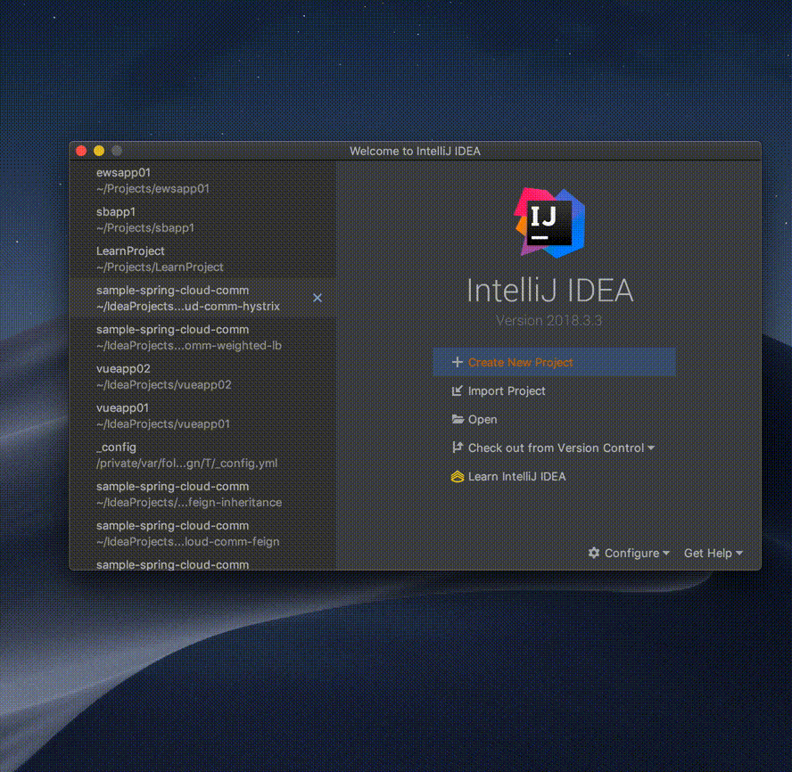
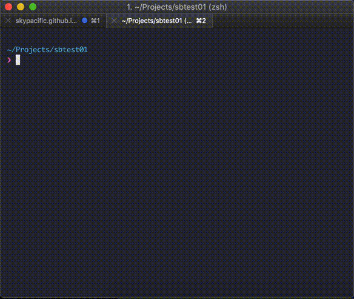
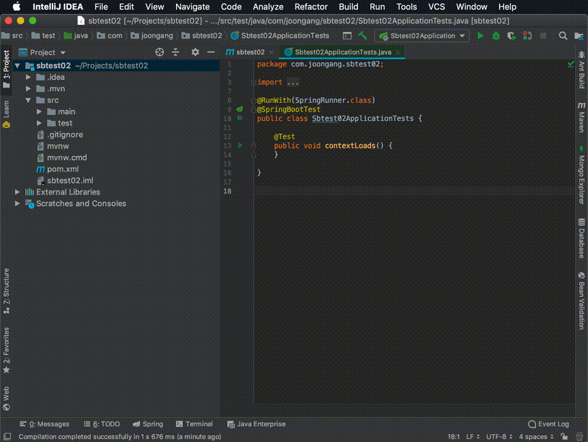
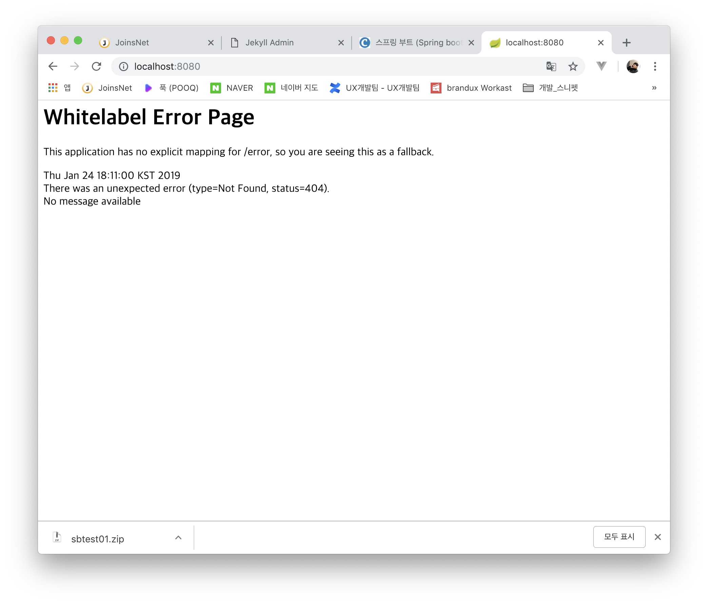
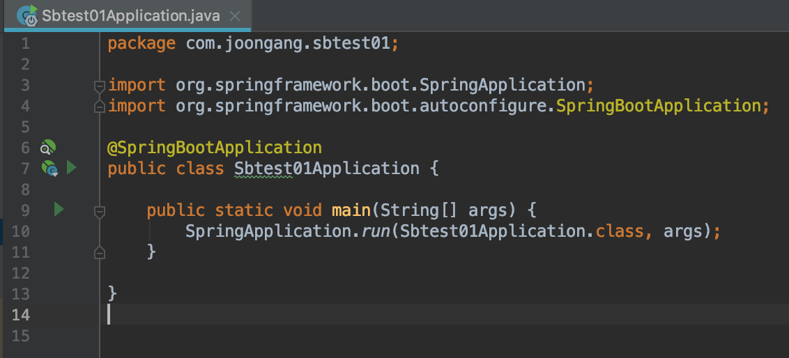
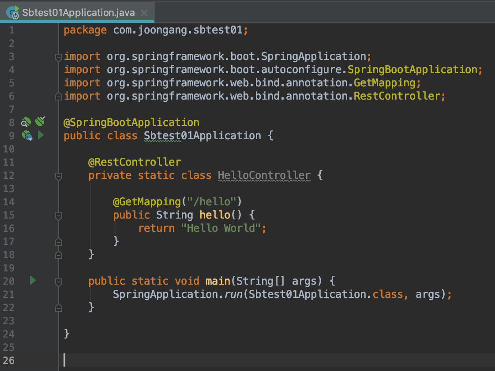
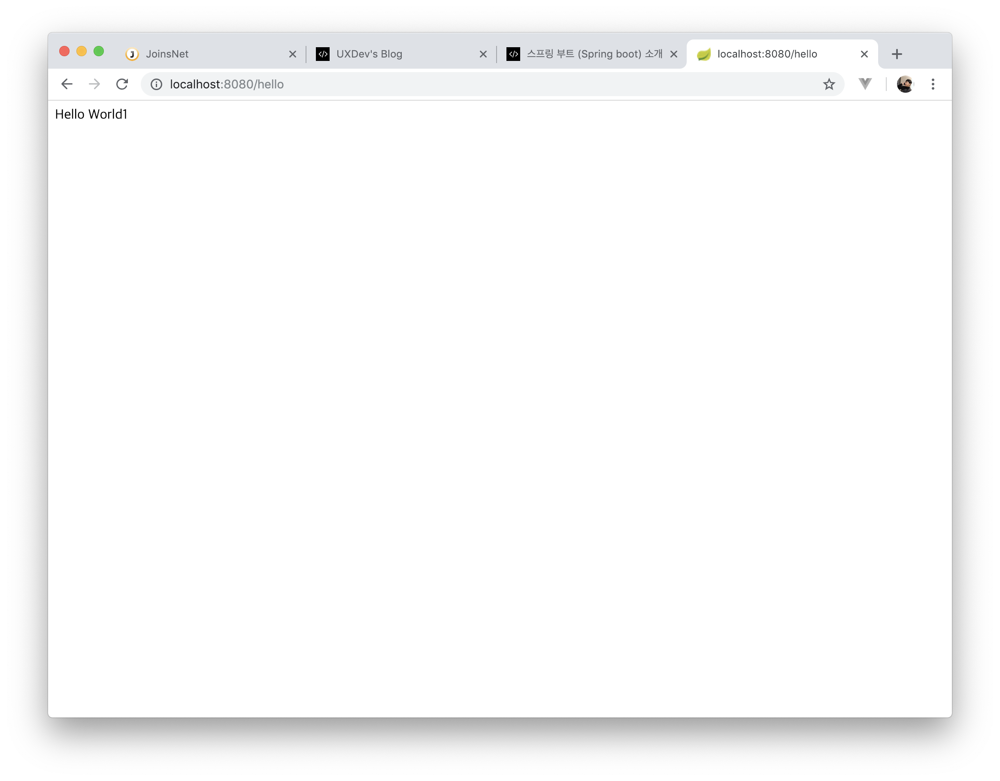

`최근 백엔드(Back-end) 자바 어플리케이션 개발에서 가장 핫한 프레임워크은 아무래도 스프링 부트가 아닐까 한다.
오늘은 이 스프링 부트에 대해 소개하는 시간을 가져본다.`

스프링 부트(Spring Boot)는 스프링 커뮤니티에서 중요하게 추진중인 프로젝트로 아래와 같은 기능을 가진다.

+ 독립실행형(stand-alone) 어플리케이션을 생성한다.
+ Tomcat, Jettry, Undertow 같은 웹어플리케이션서버(WAS)를 자체 내장하고 있다.
+ 다양한 어플리케이션 구성에 따라서 다양한 스타터("starter") 모듈들을 선택할 수 있다.
+ 스프링 및 외부 라이브러리 들의 설정을 자동으로 해준다.

이 글에서는 간단한 REST API를 만들어보기로 하자.<br/>
**Spring Initializr를 사용하는 방법**과 **통합개발환경을 사용하는 방법** 두가지 다 진행 해보도록 한다.<br/>
여기서는 통합개발환경으로 IntelliJ를 사용하였지만 Eclipse, VS Code, Atom 사용자는 [Spring Tool 4](https://spring.io/tools) 를 다운받아 설치하는것을 권장한다.

## I. Spring Initializr 로 프로젝트 시작

*Spring Initializr 는 스프링 부트스트랩 어플리케이션을 생성시켜주는 서비스 이다.*

### 1. Spring Initializr 서비스에 접속해서 프로젝트를 생성

* 아래 링크를 클릭하여 Spring Initializr 서비스로 접속한다.  
[https://start.spring.io/](https://start.spring.io/)
* 최상단의 "Generate a ..." 메뉴에서  
	+ **Build Type :** Maven Project 선택
	+ **Language :** Java 선택
	+ **Spring Boot :** 2.1.2 선택
* "Group", "Artifact" 항목에 값을 입력한다.
* "Search for dependencies" 항목에서는 이 어플리케이션에서 필요한 "Web" 모듈을 입력한다.
* 처음에는 "Search for dependencies" 항목에서 모듈 이름을 직접 입력하는것이 어려울 수 있기에,
	최하단의 "Switch back to the full version." 클릭한뒤에 "Web" 모듈을 선택한다.
* "Generate Project" 버튼을 클릭한다.
	
  

***

### 2. IntelliJ 를 사용해서 프로젝트를 생성
* IntelliJ에서 "New Project..."를 클릭하고, 왼쪽 프로젝트 템플릿 목록에서 "Spring Initializr"를 선택하고 "Next" 버튼을 클릭한다.
* "Group", "Artifact", "Type", "Language" 등의 항목에 값을 입력하고 "Next" 버튼을 클릭한다.
* 이 어플리케이션에서 필요한 "Web" 모듈을 선택하고 "Next" 버튼을 클릭한다.
* 최종적으로 입력한 내용이 맞는지 확인하고 "Finish" 버튼을 클릭한다.

`Spring Tool 4 (Eclipse) 에서는 File -> New -> Spring Starter Project 를 선택하면 된다.`

  

***

## II. 프로젝트를 빌드하고 실행

### 1. 터미널(컴맨드) 쉘에서 JAR 파일 빌드하고 실행
* 위의 프로젝트 파일이 생성된 폴더로 이동한다.  
```shell
$ cd ~/Projects/sbtest01
```	
	
* 아래 명령을 입력하여 JAR 파일을 빌드한다.
```shell
$ mvn install
```
	
* 아래 명령을 입력하여 JAR 파일을 실행한다.  
```shell
$ java -jar target/sbtest01-0.0.1-SNAPSHOT.jar
```
	
	
	
### 2. IntelliJ 에서 JAR 파일 빌드하고 실행
* IntelliJ에서 생성된 프로젝트를 연다.
* 메뉴 "Build" -> "Build Project" 를 클릭하여 프로젝트를 빌드한다.  
* 메뉴 "Run" -> "Run 프로젝트명" 를 클릭하여 프로젝트를 실행한다.

`Spring Tool 4 (Eclipse) 에서도 위와 같은 메뉴를 실행하면 된다.`

  

***


## III. 웹서비스 접속
### 1. 기본으로 생성된 웹서비스 접속

* 웹브라우져를 열고 아래 링크에 접속한다.  
[http://localhost:8080/](http://localhost:8080/)

* 홈경로("/")의 요청핸들러(Request Handler)가 없기 때문에 404 에러가 나타나는것을 확인한다.

  

### 2. /hello 요청핸들러 추가

* 프로젝트 아래에서 /src/main 디렉토리 아래의 어플리케이션 메인 자바파일을 연다.

  

* 아래 코드와 같이 간단한 /hello 핸들러를 추가한다.

    ```java
    @RestController
    private static class HelloController {

        @GetMapping("/hello")
        public String hello() {
            return "Hello World";
        }
    }
    ```

  

* 프로젝트를 다시 빌드하고 웹브라우져를 열고 아래 링크에 접속한다.  
[http://localhost:8080/hello](http://localhost:8080/hello)

* /hello 요청핸들러(Request Handler)가 작동하여 "Hello World" 문자열이 나타나는것을 확인한다.

  

***

본 예제 결과물 sbtest01.zip 소스파일은 아래 링크에서 다운받을 수 있다.  
<i class="nf nf-fa-archive"></i> [sbtest01.zip 소스파일]({{ "/assets/download/sbtest01.zip" | absolute_url }})

***
